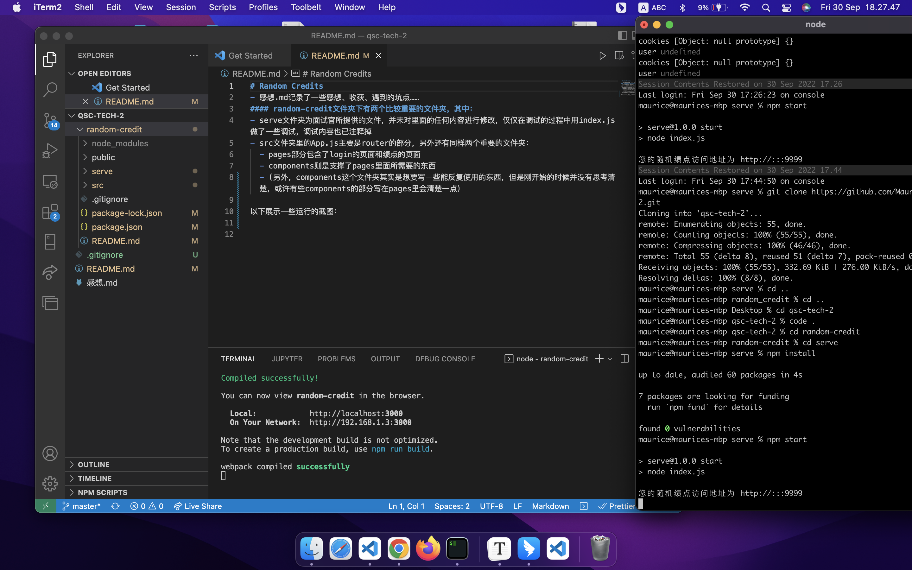
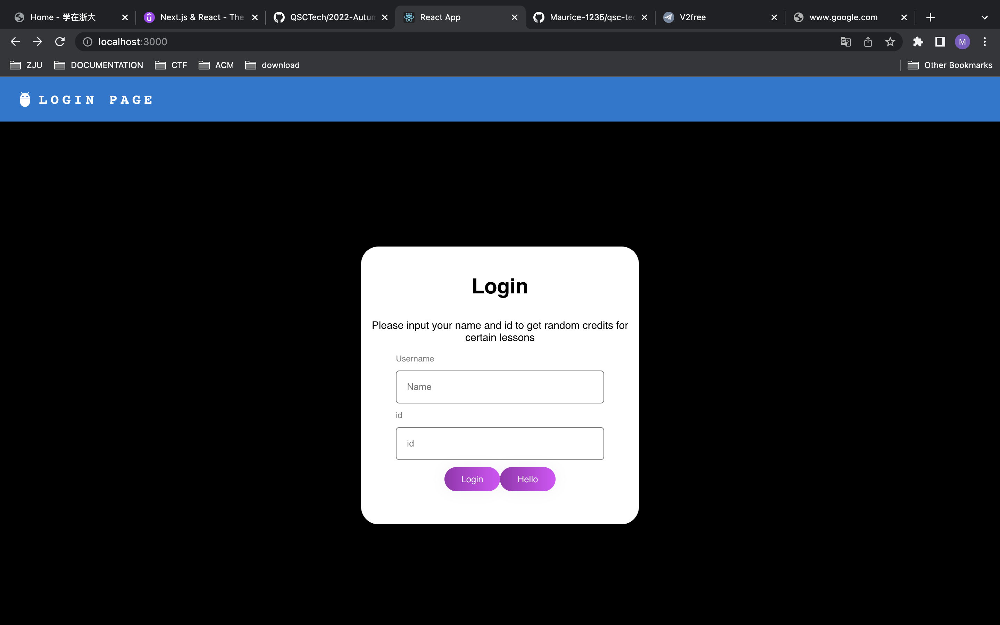
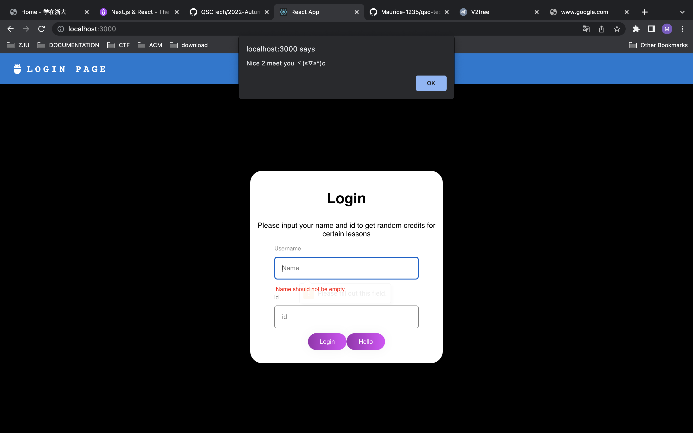
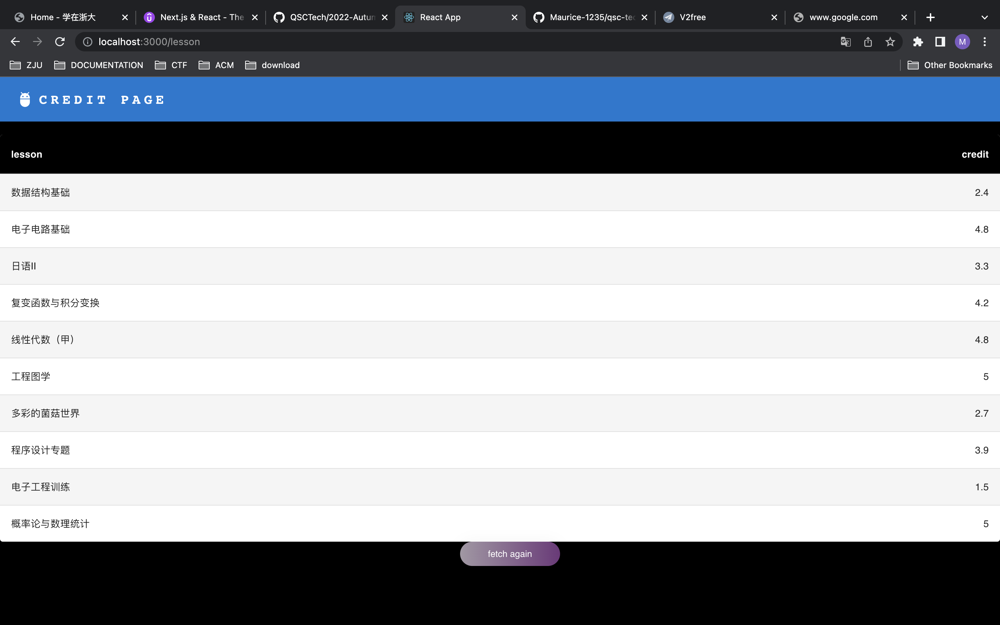
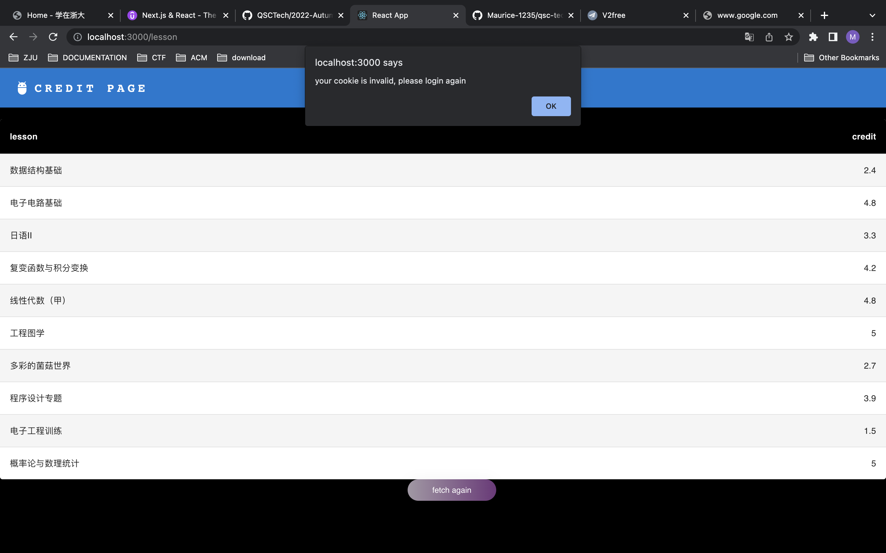

# Random Credits
- 感想.md记录了一些感想、收获、遇到的坑点……
#### random-credit文件夹下有两个比较重要的文件夹，其中：
- serve文件夹为面试官所提供的文件，并未对里面的任何内容进行修改，仅仅在调试的过程中用index.js做了一些调试，调试内容也已注释掉
- src文件夹里的App.js主要是router的部分，另外还有同样两个重要的文件夹：
  - pages部分包含了login的页面和绩点的页面
  - components则是支撑了pages里面所需要的东西
  - (另外，components这个文件夹其实是想要写一些能反复使用的东西，但是刚开始的时候并没有思考清楚，或许有些components的部分写在pages里会清楚一点）

以下展示一些运行的截图：

<b>npm start</b>

<b>login page</b>

<b>hello</b>

<b>credit page</b>

<b>cookie expired</b>

- 文档中提到的自动登录功能也已实现，但是截图可能没有那么明显，所以没有截 
- form,navbar,table等代码引用or参考了网络上的代码，已在文件最顶端注明。
